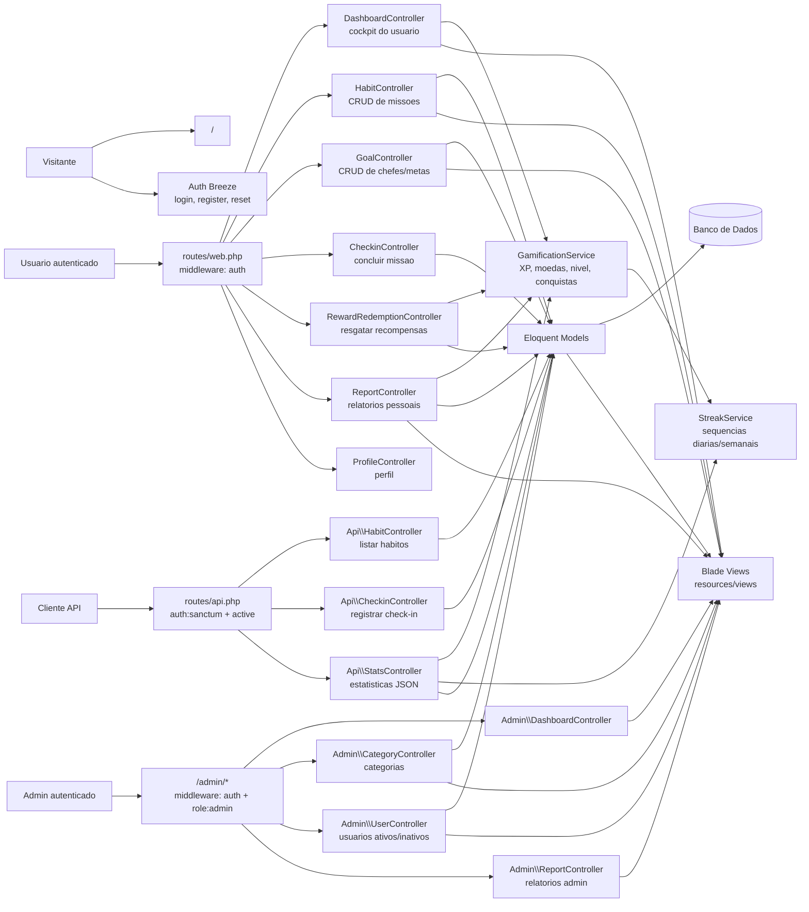
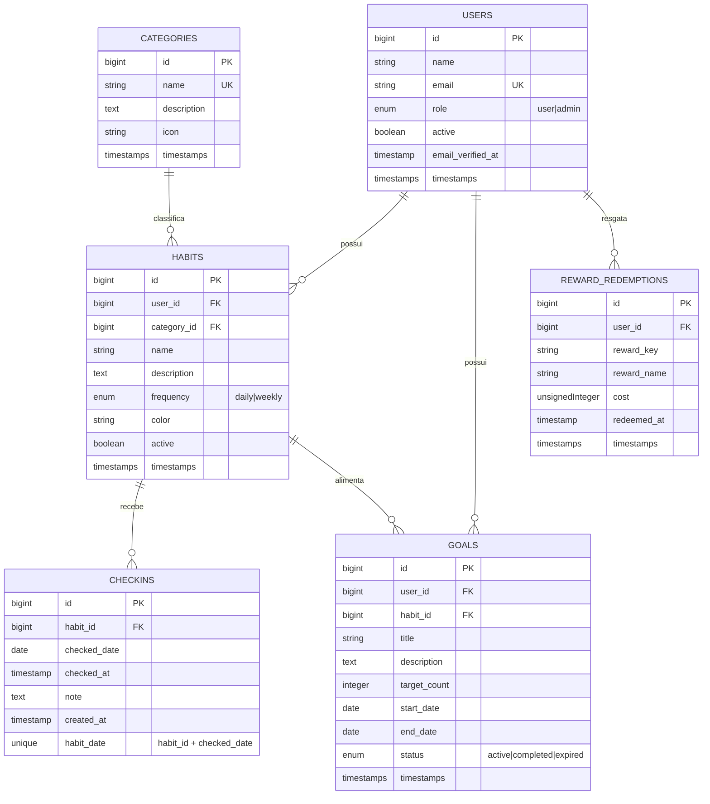
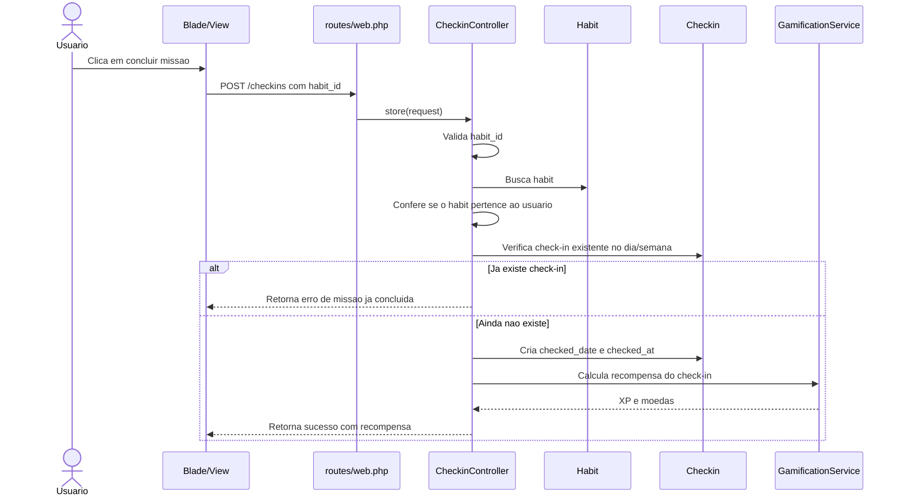
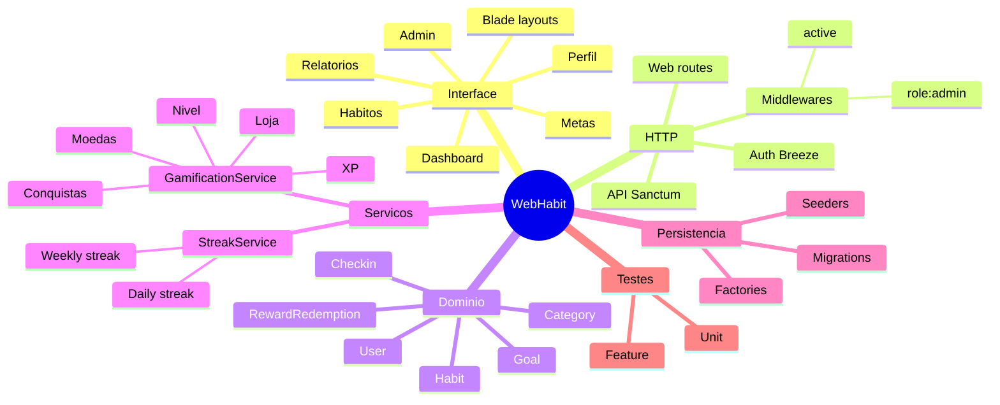

# Diagrama Visual do Projeto WebHabit

Este documento resume a arquitetura do WebHabit, os relacionamentos principais do banco e o fluxo de check-in. Os diagramas usam Mermaid e podem ser visualizados em editores com suporte a Mermaid, como GitHub, GitLab e extensões do VS Code.

## Visao Geral

## Modelo de Dados

## Fluxo de Check-in

## Modulos por Responsabilidade

